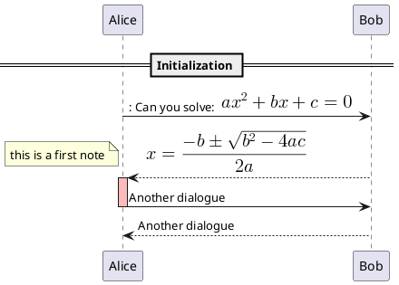
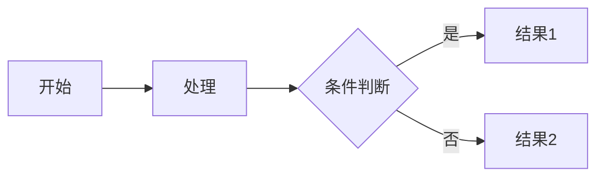

# Untitled

```plantuml
@startuml

== Initialization ==

Alice -> Bob: : Can you solve: <math>ax^2+bx+c=0</math>
Bob --> Alice: <math>x = (-b+-sqrt(b^2-4ac))/(2a)</math>
activate Alice #FFBBBB
note left: this is a first note

Alice -> Bob: Another dialogue
deactivate Alice

Alice <-- Bob: Another dialogue

@enduml
```

```mermaid
flowchart LR
A[开始] --> B[处理]
B --> C{条件判断}
C -->|是| D[结果1]
C -->|否| E[结果2]
```

Start writing your notes here...
