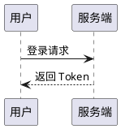
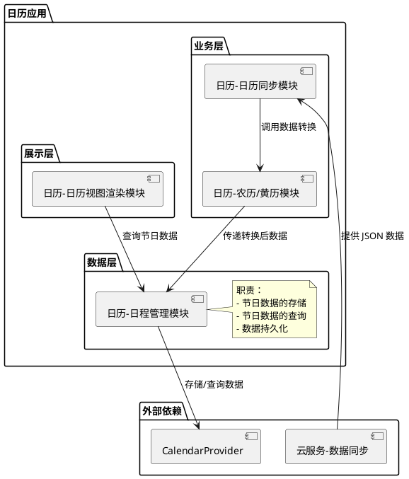
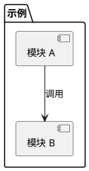
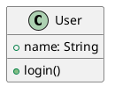

# PlantUML 渲染测试

在 NoteZ 中打开本文件，使用 **分屏** 或 **全屏（WYSIWYG）** 模式预览，用于验证 PlantUML 渲染、报错行号、AI 修复等功能。

---

## 1. 正常：简单时序图

应成功渲染。



---

## 2. 正常：组件图（嵌套 package + note）

应成功渲染（与仓库 fixture `nested_package_with_notes.puml` 一致）。



---

## 3. 错误：package 关键字后缺少空格（约第 3 行）

**预期**：渲染失败，报错行高亮为第 3 行，可点击 **AI 修复**。

常见错误信息：`Syntax Error? (Assumed diagram type: sequence)`

```plantuml
@startuml
skinparam defaultFontName "Microsoft YaHei"
package"日历应用" {
    package "数据层" {
        [日历-日程管理模块] as DataLayer
        note right of DataLayer
            职责：
            - 节日数据的存储
            - 节日数据的查询
            - 数据持久化
        end note
```

> 故意省略 `}` 与 `@enduml`，用于测试不完整源码的报错与修复。

---

## 4. 错误：缺少闭合括号

**预期**：渲染失败，提示语法错误；修复后应补全 `}` 与 `@enduml`。



---

## 5. 错误：时序图消息语法错误

**预期**：渲染失败（JAR 路径）；Rust 引擎可能跳过未识别行或部分报错。

```plantuml
@startuml
participant Alice
participant Bob
Alice ->> Bob 缺少冒号与标签
Bob --> Alice : ok
@enduml
```

---

## 6. 多块图表（同文件）

第一个块正常，第二个块故意写错，用于测试「多块时只修复匹配块」。

### 6.1 正常块



### 6.2 错误块

```plantuml
@startuml
class Order {
  +id: int
  +total: double
' 缺少闭合花括号
@enduml
```

---

## 7. 主题与 skinparam

验证 `!theme` / `skinparam` 是否生效（依赖设置中的 PlantUML 主题）。


---

## 测试检查清单

| 场景 | 操作 |
|------|------|
| 正常渲染 | 打开 §1、§2，预览区应显示 SVG |
| 报错行号 | 打开 §3，应显示「第 3 行」徽章与源码高亮 |
| AI 修复 | §3 点击 **AI 修复** → AI 面板仅发送 **一条** 修复请求 → 确认后 **应用修复** |
| 回退 | 应用修复后点击 **回退**，源码应恢复为修复前 |
| 多块 | §6 应用修复时只替换第一个匹配的错误块 |
